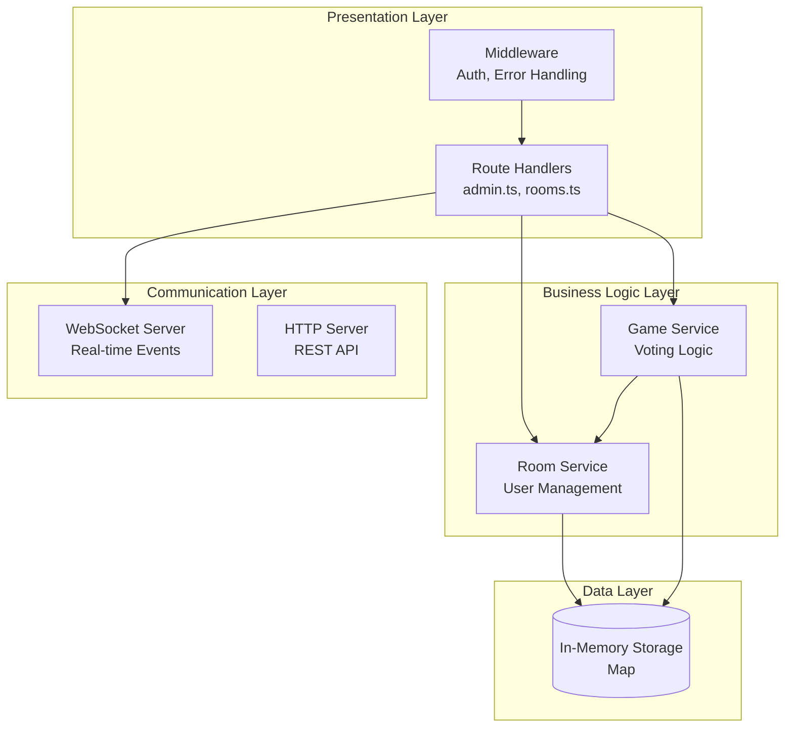
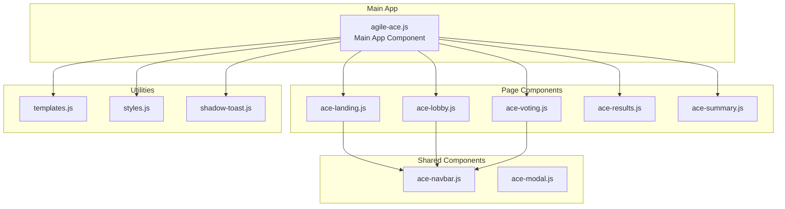

# Technische Dokumentation - Scrum Poker Anwendung

## Architektur-Überblick

Die Anwendung ist eine **Full-Stack TypeScript/JavaScript** Anwendung mit einem **Express.js Backend** und einem **Vanilla JavaScript Frontend**. Sie verwendet **WebSockets** für Real-time Kommunikation und **In-Memory Storage** für Daten.

### Technology Stack

**Backend:**
- **Node.js** mit **TypeScript**
- **Express.js** - REST API Framework
- **WebSocket (ws)** - Real-time Kommunikation
- **Vitest** - Testing Framework

**Frontend:**
- **Vanilla JavaScript** mit **Web Components**
- **Shadow DOM** für Kapselung
- **WebSocket Client** für Real-time Updates
- **CSS3** für Styling

**Development & Build:**
- **TypeScript Compiler** für Backend
- **Vite** für Frontend Build
- **Playwright** für E2E Tests
- **Docker** für Containerisierung

## Projekt-Struktur

```
scrum-poker/
├── server/
│   ├── src/                    # TypeScript Backend Source
│   │   ├── index.ts           # Server Entry Point
│   │   ├── middleware/        # Express Middleware
│   │   │   ├── adminAuth.ts   # Admin Authorization
│   │   │   └── errorHandler.ts # Error Handling
│   │   ├── routes/            # API Route Handlers
│   │   │   ├── admin.ts       # Admin Operations (/ban, /start, /items)
│   │   │   └── rooms.ts       # Room Operations (/create, /join)
│   │   ├── services/          # Business Logic Layer
│   │   │   ├── RoomService.ts # Room Management
│   │   │   └── GameService.ts # Game Flow Logic
│   │   ├── types/             # TypeScript Definitions
│   │   │   └── index.ts       # Shared Types & Interfaces
│   │   └── utils/             # Utility Functions
│   │       ├── validation.ts  # Input Validation
│   │       └── ws.ts          # WebSocket Utilities
│   ├── public/                # Frontend Static Files
│   │   ├── index.html         # Main Entry Page
│   │   ├── js/                # JavaScript Components
│   │   │   ├── agile-ace.js   # Main App Component
│   │   │   ├── components/    # Reusable Components
│   │   │   └── pages/         # Page Components
│   │   ├── css/               # Stylesheets
│   │   └── html/              # HTML Templates
│   ├── tests/                 # Backend Tests
│   ├── dist/                  # Compiled TypeScript Output
│   └── package.json           # Dependencies & Scripts
```

## Architektur-Pattern

### Backend: Layered Architecture



### Frontend: Component-Based Architecture



## Datenmodell

### Room Structure
```typescript
interface Room {
  admin: User;              // Room Administrator
  users: User[];            // Regular Participants
  items: string[];          // Items to estimate
  itemHistory: string[];    // Completed items
  votes: Record<string, string>; // Current votes
  status: RoomStatus;       // Current game state
  bannedIps: string[];      // Banned IP addresses
}

interface User {
  name: string;
  ip: string;
}

enum RoomStatus {
  SETUP = "setup",           // Room created, waiting for items
  ITEMS_SUBMITTED = "items_submitted", // Items added, ready to start
  VOTING = "voting",         // Active voting phase
  REVEALING = "revealing",   // Votes revealed
  COMPLETED = "completed"    // All items estimated
}
```

## API Endpoints

### Room Operations (`/api/rooms.ts`)
```
POST /create              # Create new room
POST /join               # Join existing room
GET  /is-admin           # Check admin status
GET  /room/:id/items     # Get room items
GET  /room/:id/participants # Get participants
GET  /room/:id/status    # Get room status
POST /room/:id/vote      # Submit vote
```

### Admin Operations (`/api/admin.ts`)
```
POST /room/:id/items     # Set estimation items
POST /room/:id/start     # Start voting
POST /room/:id/reveal    # Reveal votes
POST /room/:id/repeat    # Repeat current item
POST /room/:id/next      # Move to next item
POST /room/:id/summary   # Show final summary
POST /room/:id/ban       # Ban user from room
```

## WebSocket Events

### Client → Server
```javascript
{
  roomId: number,
  role: "admin" | "player",
  payload: { name: string }
}
```

### Server → Client
```javascript
// Game State Changes
{ event: "cards-revealed", results: Vote[], allPlayers: User[] }
{ event: "reveal-item", allPlayers: User[], item: string }
{ event: "show-summary", summary: Summary }
{ event: "vote-status-update", votedPlayers: string[] }

// User Management
{ event: "user-joined", user: string, rejoin: boolean }
{ event: "user-banned", user: string }
{ event: "banned-by-admin" }
```

## Development Workflow

### Build Process
```bash
# Backend TypeScript Compilation
npm run build           # tsc → dist/

# Frontend Development
npm run dev            # Serve static files

# Testing
npm run test           # Vitest unit tests
npm run test:e2e       # Playwright integration tests
```

### Key Scripts (`package.json`)
```json
{
  "scripts": {
    "build": "tsc",
    "start": "node dist/index.js",
    "dev": "nodemon --exec ts-node src/index.ts",
    "test": "vitest",
    "test:e2e": "playwright test"
  }
}
```

## Security & Validation

### Input Validation
- **Username/Items**: Regex pattern `^[^<>&]{0,100}$` (No HTML/XSS)
- **Room ID**: Numeric validation
- **IP-based Admin/Ban System**

### Authorization
- **Admin Operations**: IP-based authentication
- **Room Access**: Banned IP checking
- **WebSocket**: Room-based message filtering

## Deployment

### Docker Configuration
```dockerfile
FROM node:18-alpine
WORKDIR /app
COPY package*.json ./
RUN npm ci --only=production
COPY dist/ ./dist/
COPY public/ ./public/
EXPOSE 3000
CMD ["node", "dist/index.js"]
```

### Environment Variables
```bash
PORT=3000              # Server port
NODE_ENV=production    # Environment mode
```

## Performance Considerations

### Memory Management
- **In-Memory Storage**: Rooms auto-deleted after completion
- **WebSocket Connections**: Cleaned up on disconnect
- **Room Cleanup**: 5-second delay after summary

### Scalability Limitations
- **Single Instance**: No clustering/load balancing
- **Memory Storage**: Lost on restart
- **IP-based Auth**: Not suitable for NAT environments

## Testing Strategy

### Unit Tests (`/tests/`)
- **Services**: Business logic validation
- **Routes**: API endpoint testing
- **Middleware**: Auth & error handling
- **Utils**: WebSocket & validation functions

### Integration Tests
- **Playwright**: Full user flow testing
- **WebSocket**: Real-time communication testing
- **Error Scenarios**: Network failure handling

## Known Technical Debt

1. **No Persistence**: All data lost on server restart
2. **IP-based Auth**: Problematic in corporate networks
3. **No Rate Limiting**: Potential for abuse
4. **Manual Memory Management**: No automatic cleanup
5. **Monolithic Frontend**: Large single-file components

## Future Improvements

- **Database Integration** (PostgreSQL/Redis)
- **JWT-based Authentication**
- **Rate Limiting & DDoS Protection**
- **Frontend Framework Migration** (React/Vue)
- **Horizontal Scaling Support**
- **Persistent WebSocket Reconnection**