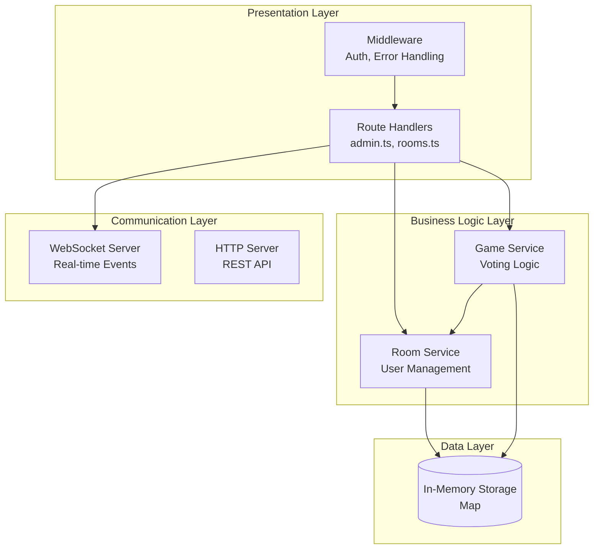
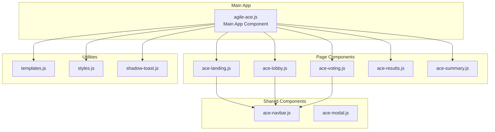
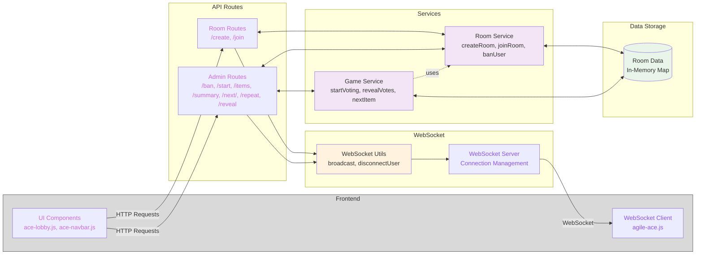
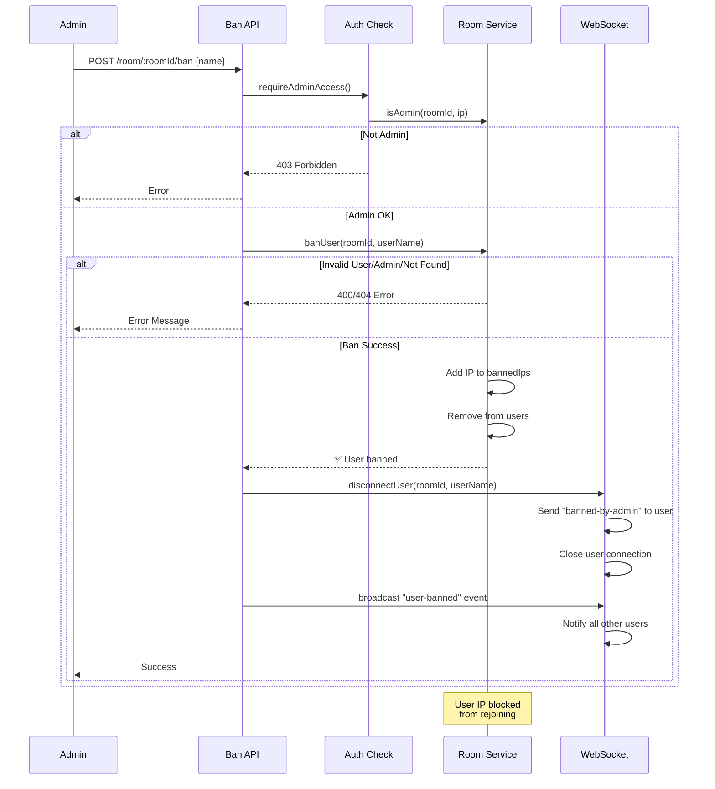
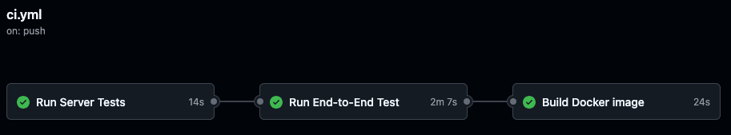

## Architektur-Überblick

Die Anwendung ist eine **Full-Stack TypeScript/JavaScript** Anwendung mit einem **Express.js Backend** und einem **Vanilla JavaScript Frontend**. Sie verwendet **WebSockets** für Echtzeitkommunikation und **In-Memory Storage** für Daten.

### Technologie-Stack

**Backend:**
- **Node.js** mit **TypeScript**
- **Express.js** - REST-API-Framework
- **WebSocket (ws)** - Echtzeitkommunikation mit Benutzern
- **Vitest** - Testframework

**Frontend:**
- **Vanilla JavaScript** mit **Web Components**
- **Shadow DOM** für Kapselung
- **WebSocket-Client** für den Empfang von Echtzeit-Updates
- **CSS3** für Styling
- **Playwright** für E2E-Tests

**Entwicklung & Build:**
- **TypeScript-Compiler** für Backend
- **Vite** für Frontend-Build
- **Playwright** für E2E-Tests
- **Docker** für Containerisierung

## Projekt-Struktur

```
scrum-poker/
├── server/
│   ├── src/                    # TypeScript Backend Source
│   │   ├── index.ts           # Server Entry Point
│   │   ├── middleware/        # Express Middleware
│   │   │   ├── adminAuth.ts   # Admin Authorization
│   │   │   └── errorHandler.ts # Error Handling
│   │   ├── routes/            # API Route Handlers
│   │   │   ├── admin.ts       # Admin Operations (/ban, /start, /items)
│   │   │   └── rooms.ts       # Room Operations (/create, /join)
│   │   ├── services/          # Business Logic Layer
│   │   │   ├── RoomService.ts # Room Management
│   │   │   └── GameService.ts # Game Flow Logic
│   │   ├── types/             # TypeScript Definitions
│   │   │   └── index.ts       # Shared Types & Interfaces
│   │   └── utils/             # Utility Functions
│   │       ├── validation.ts  # Input Validation
│   │       └── ws.ts          # WebSocket Utilities
│   ├── public/                # Frontend Static Files
│   │   ├── index.html         # Main Entry Page
│   │   ├── js/                # JavaScript Components
│   │   │   ├── agile-ace.js   # Main App Component
│   │   │   ├── components/    # Reusable Components
│   │   │   └── pages/         # Page Components
│   │   ├── css/               # Stylesheets
│   │   └── html/              # HTML Templates
│   ├── tests/                 # Backend Tests
│   ├── dist/                  # Compiled TypeScript Output
│   └── package.json           # Dependencies & Scripts
```

## Architektur-Muster



## Frontend: Komponentenbasierte Architektur



In den einzelnen Pages werden Events dispatched (`this.dispatchEvent`; Beispiel-Event: `ace-back-to-landing`), welche im Root der Komponente (`agile-ace.js`) gefangen werden. Im Falle von `ace-back-to-landing` wird durch einen Klick auf "Back to main page" der Komponente mitgeteilt, dass diese zurück auf die Landing-Page gehen soll. Die Root der Komponente rendert die Landing-Page daraufhin. Auf diese Weise kommuniziert die Komponente intern zwischen den einzelnen Seiten.

## Kommunikation Client ←→ Server



## Benutzer-Sperrablauf

Im Folgenden ist dargestellt, was passiert, wenn ein Benutzer gesperrt werden soll.



## Datenmodell

### Raumstruktur
```typescript
interface Room {
  admin: User;              // Room Administrator
  users: User[];            // Regular Participants
  items: string[];          // Items to estimate
  itemHistory: string[];    // Completed items
  votes: Record<string, string>; // Current votes
  status: RoomStatus;       // Current game state
  bannedIps: string[];      // Banned IP addresses
}

interface User {
  name: string;
  ip: string;
}

enum RoomStatus {
  SETUP = "setup",           // Room created, waiting for items
  ITEMS_SUBMITTED = "items_submitted", // Items added, ready to start
  VOTING = "voting",         // Active voting phase
  REVEALING = "revealing",   // Votes revealed
  COMPLETED = "completed"    // All items estimated
}
```

## API-Endpunkte

### Raum-Operationen (`/api/rooms.ts`)
```text
POST /create              # Create new room
POST /join                # Join existing room
GET  /is-admin            # Check admin status
GET  /room/:id/items      # Get room items
GET  /room/:id/participants # Get participants
GET  /room/:id/status     # Get room status
POST /room/:id/vote       # Submit vote
```

### Administrator-Operationen (`/api/admin.ts`)
```text
POST /room/:id/items      # Set estimation items
POST /room/:id/start      # Start voting
POST /room/:id/reveal     # Reveal votes
POST /room/:id/repeat     # Repeat current item
POST /room/:id/next       # Move to next item
POST /room/:id/summary    # Show final summary
POST /room/:id/ban        # Ban user from room
```

## WebSocket-Ereignisse

### Client → Server
Direkt nach der erfolgreichen ws connection wird eine Nachricht vom Client an den Server geschickt, welche raumId und Name des Users enthält, damit die connection zugeordnet werden kann. Alle anderen events werden entsprechend unserer Architektur ausschließlich vom Server zum Client geschickt.
```javascript
{
  roomId: number,
  role: "admin" | "player",
  payload: { name: string }
}
```

### Server → Client
```javascript
// Game State Changes
{ event: "cards-revealed", results: Vote[], allPlayers: User[] }
{ event: "reveal-item", allPlayers: User[], item: string }
{ event: "show-summary", summary: Summary }
{ event: "vote-status-update", votedPlayers: string[] }

// User Management
{ event: "user-joined", user: string, rejoin: boolean }
{ event: "user-banned", user: string }
{ event: "banned-by-admin" }
```

## Sicherheit & Validierung

### Eingabevalidierung
- **Benutzername/Items**: RegEx-Muster `^[^<>&]{0,100}$` (Kein HTML/XSS) und Überprüfung auf definierte gesperrte Begriffe mittels RegEx
- **Raum-ID**: Numerische Validierung
- **IP-basiertes Admin-/Sperrsystem**

### Autorisierung
- **Administrator-Operationen**: IP-basierte Authentifizierung
- **Raumzugang**: Überprüfung gesperrter IPs
- **WebSocket**: Raumbezogene Nachrichtenfilterung

## CI-Pipeline

Unsere CI-Pipeline besteht aus mehreren Automatisierungsschritten, die bei jedem Push oder Pull Request auf dem **main**‑Branch ausgelöst werden:

1. **Server-Tests ausführen**
   - Repository auschecken
   - Node.js (Version 18) installieren
   - Abhängigkeiten im **server/**-Verzeichnis mit `npm ci` installieren
   - Unit- und Integrationstests mit `npm test` ausführen

2. **End-to-End‑Tests (Playwright)**
   - Abhängigkeiten erneut installieren (via Cache) und Playwright‑Browser installieren
   - Playwright‑Tests sequenziell (`--workers=1`) ausführen
   - Bei Fehlschlägen werden Test‑Artefakte (Berichte und Ergebnisse) hochgeladen

3. **Docker‑Image bauen und veröffentlichen**
   - Image mit dem aktuellen Commit-Hash und dem "latest"‑Tag erstellen
   - Als Paket im GitHub Container Registry (GHCR) ablegen

Auf dem Produktionsserver läuft zusätzlich **Watchtower**, das zyklisch das GHCR‑Repository überprüft und automatisch das Docker‑Image aktualisiert, sobald eine neue Version verfügbar ist.


